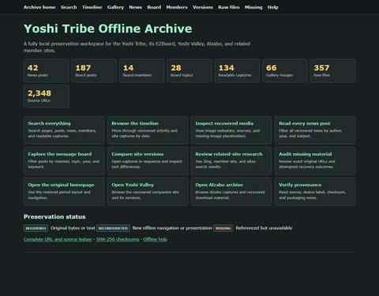

# Yoshi Tribe Archive — Screenshot Gallery

Visual documentation here is tied to actual recovered archive material. Images are not redesigned mockups.

## Preserved screenshots

### Offline archive hub

- Repository file: `archive-home.jpg`
- Source artifact: `archive-final-hub.png`
- Status: **actual archive-workspace capture**
- Shows the preservation hub used to navigate the recovered collections.

### Restored original Yoshi Tribe homepage

- Repository file: `original-homepage.jpg`
- Source artifact: `archive-final-original-home.png`
- Status: **actual recovered/restored-site capture**

Both GitHub images are compressed previews for repository readability; the higher-resolution source captures remain retained in the archive workspace.

## Additional confirmed source screenshots

| Page / view | Source artifact | Repository target | Status |
|---|---|---|---|
| Archive hub | `archive-final-hub.png` | `archive-home.jpg` | **Preserved here** |
| Original desktop homepage | `archive-final-original-home.png` | `original-homepage.jpg` | **Preserved here** |
| Original mobile homepage | `archive-final-original-mobile.png` | `original-mobile.jpg` | Source confirmed |
| Mobile verification | `yoshitribe-mobile-check.png` | `mobile-check.png` | Source confirmed |

## Archive-interface capture queue

| Page | Suggested image | What it documents |
|---|---|---|
| Search | `search.jpg` | Search controls and recovered collection search |
| Timeline | `timeline.jpg` | Chronological archive browser |
| Gallery | `gallery.jpg` | Recovered-media interface |
| News | `news-browser.jpg` | News archive and filters |
| Board explorer | `board-explorer.jpg` | Preserved EZBoard browsing |
| Members | `board-members.jpg` | Recovered member index |
| Site versions | `site-versions.jpg` | Historical capture/version browser |
| Raw files | `raw-files.jpg` | Preservation-file inventory |
| Missing materials | `missing-materials.jpg` | Recovery-status/missing-material research |
| Provenance | `provenance.jpg` | Source and preservation documentation |
| Yoshi Valley | `yoshi-valley.jpg` | Recovered companion site |
| Alzabo | `alzabo.jpg` | Related recovered archive |

## Screenshot rules

1. Use actual archived/recovered pages or established reconstructed archive interfaces.
2. Record the source artifact/page represented by each image.
3. Keep reconstructed archive tooling distinguishable from period-original pages.
4. Do not substitute newly designed approximations for missing historical screenshots.
5. Prefer smaller GitHub preview images while retaining higher-resolution source captures in the preservation workspace.

This keeps visual documentation tied to preservation evidence rather than treating screenshots as decoration.